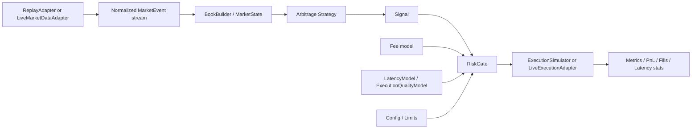

# Replay-First Arbitrage Engine with Systems-Design and Risk Modeling

## Summary
- Build the repo as a credible replay-first triangular arbitrage simulator with strong low-level systems design throughout.
- Keep two parallel goals:
  - `Viability`: realistic market-state, fees, latency, execution simulation, and measurable results.
  - `Systems showcase`: cache-aware data layout, allocation discipline, explicit concurrency boundaries, benchmarking, and measured optimization.
- Treat probabilistic latency/risk modeling as a downstream `risk gate` concern, not part of the graph detector and not an early-phase dependency.
- Treat the Gaussian Process idea as an optional later implementation of a `LatencyModel` interface, not as the default architecture.

## Target Architecture

- `Strategy` finds candidate arbitrage paths from executable market state.
- `RiskGate` decides whether a candidate is worth acting on after fees, latency, slippage, and fill-risk assumptions.
- `ExecutionSimulator` converts accepted signals into simulated fills and realized PnL during replay.
- `LatencyModel` is not embedded in the hot detection loop; it is a replaceable component consumed by `RiskGate` and the simulator.

## Implementation Changes
- Phase 0: align repo truth and create a measurable foundation
  - Rewrite the README so it clearly separates:
  - current prototype
  - target replay engine
  - future production/HFT extensions
  - Remove claims that the GP-based latency model and risk-aware execution already exist.
  - Add a benchmark and profiling harness for replay throughput, queue depth, event lag, detection latency, allocation count, and memory footprint.
  - Fix prototype operability assumptions such as relative-path coupling and clean shutdown behavior.

- Phase 1: build the canonical replay core
  - Introduce a normalized `MarketEvent` with exchange timestamp, receive timestamp, event type, symbol, and executable market fields.
  - Replace CSV-as-integration-boundary with a `ReplayAdapter` that emits typed events in deterministic order.
  - Add a `Clock` abstraction supporting replay-time and wall-time modes.
  - Keep the data path simple and benchmarkable before introducing more concurrency.

- Phase 2: make market realism minimally credible
  - Build top-of-book state first, not full L2 depth.
  - Compute arbitrage on executable bid/ask prices rather than last-trade price.
  - Add fee-aware opportunity calculation and size limits.
  - Report gross edge separately from fee-adjusted edge.
  - This is the minimum viable architecture for believable arbitrage signals.

- Phase 3: integrate low-level systems design into the hot path
  - Redesign hot structs and state for cache locality and minimal pointer chasing.
  - Remove avoidable steady-state dynamic allocation using pre-sized buffers, pools, or arenas where measurement justifies it.
  - Define explicit concurrency boundaries between ingestion, market state, strategy, risk, and execution.
  - Reassess queue topology based on actual ownership; keep SPSC only where the boundary is truly single-producer/single-consumer.
  - Add microbenchmarks for parsing, event dispatch, market-state update, queue behavior, and cycle detection.
  - Document major choices such as sharding, batching, false-sharing avoidance, and alignment with measured results.

- Phase 4: add execution simulation and deterministic risk gating
  - Introduce `Signal`, `OrderIntent`, `FillReport`, and `RunMetrics`.
  - Add an `ExecutionSimulator` with configurable fixed or distribution-based latency, fees, slippage, and partial-fill behavior.
  - Introduce `RiskGate` that accepts or rejects candidate signals based on expected net outcome after execution assumptions.
  - Start with simple latency models:
  - fixed latency
  - empirical percentile/bucketed latency distributions
  - scenario-based latency stress tests
  - The goal here is not ML yet; it is to create the architecture and evaluation loop that risk modeling will plug into.

- Phase 5: add probabilistic latency / execution-quality modeling
  - Add a `LatencyModel` interface consumed by `RiskGate` and `ExecutionSimulator`.
  - Train models offline in Python; load artifacts or parameters into the C++ runtime.
  - First useful targets are:
  - expected execution delay
  - latency percentile estimates
  - probability of staying profitable after delay
  - expected realized PnL under delay and fill assumptions
  - Prefer simple baselines first:
  - empirical conditional distributions
  - quantile regression
  - tree-based regressors
  - Only evaluate Gaussian Process models after those baselines exist.
  - If a GP is adopted, keep it as one implementation of `LatencyModel`, not as a hard architectural dependency.
  - Do not place Python inference or heavyweight ML logic directly in the critical detection path.

- Phase 6: prepare live-system extensions
  - Add `MarketDataAdapter` and `ExecutionAdapter` interfaces so replay and live modes share the same core engine.
  - Only after replay results remain credible should the repo grow live-feed handling and operational concerns.
  - Networking and HFT-specific topics such as socket tuning, hardware timestamping, kernel bypass, and FPGA stay in the documented future-extension track until a real live path exists.

## Interfaces / Types To Add
- `struct MarketEvent`
- `struct TopOfBook`
- `struct Signal`
- `struct OrderIntent`
- `struct FillReport`
- `struct RunMetrics`
- `class Clock`
- `class BenchmarkHarness`
- `class ReplayAdapter`
- `class MarketDataAdapter`
- `class BookBuilder`
- `class StrategyEngine`
- `class RiskGate`
- `class ExecutionSimulator`
- `class LatencyModel`
- `class ExecutionAdapter`

## Test and Benchmark Plan
- Functional tests
  - replay startup, shutdown, and deterministic ordering
  - no-arb and arb fixtures using bid/ask and fees
  - accepted vs rejected signals through `RiskGate`
  - simulated fills and realized PnL consistency
- Risk-model tests
  - fixed-latency and distribution-latency scenarios produce expected gate decisions
  - stress cases where gross edge is positive but expected net edge is negative
  - model outputs remain separate from strategy detection outputs
- Systems tests
  - end-to-end events/sec
  - p50/p95/p99 detection latency
  - allocation count on the steady-state path
  - queue depth, backpressure, and batch-size sensitivity
  - effects of sharding, alignment, and false-sharing mitigation
- Showcase deliverables
  - one benchmark report per hot subsystem
  - one short design note per major low-level optimization explaining tradeoffs and measured benefit

## Assumptions
- The next major milestone remains `replay first`.
- Top-of-book state is sufficient for the first credible arbitrage simulator; full depth is not required initially.
- Probabilistic latency modeling is a later-phase enhancement to `RiskGate`, not an early design center.
- The right architecture is “execution-quality-aware risk gating,” where a GP may be evaluated later but is not assumed to be the winning model.
- Low-level systems work should be integrated continuously, but only behind stable interfaces and only where measurements justify it.
